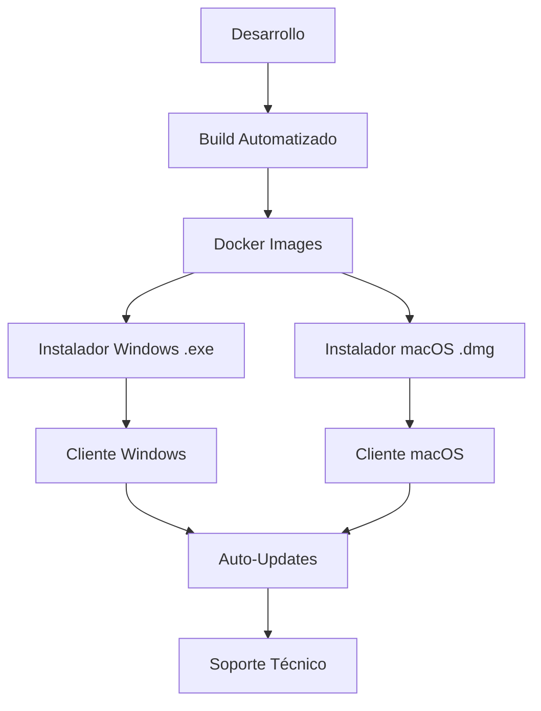

# 📦 PLAN DE DISTRIBUCIÓN Y DEPLOYMENT - SGMM
## Sistema de Gestión Médica - De Desarrollo a Producción

---

## 📋 INFORMACIÓN DEL PROYECTO

**Proyecto:** SGMM (Sistema de Gestión Médica)  
**Objetivo:** Transformar aplicación de desarrollo en producto distribuible  
**Target:** Médicos estéticos y clínicas pequeñas/medianas  
**Fecha Creación:** Junio 23, 2025  
**Versión Plan:** 1.0  

---

## 🎯 RESUMEN EJECUTIVO

Este plan detalla la transformación completa de SGMM desde una aplicación en desarrollo hacia un producto comercial listo para distribución masiva, instalación simple y soporte escalable.

### **OBJETIVOS PRINCIPALES:**
- ✅ Instalación en 1-click para usuarios no técnicos
- ✅ Distribución multiplataforma (Windows + macOS)
- ✅ Sistema de soporte técnico eficiente
- ✅ Actualizaciones automáticas y sin interrupciones
- ✅ Modelo de negocio B2B sostenible

---

## 🏗️ ARQUITECTURA DE DISTRIBUCIÓN

### **STACK TECNOLÓGICO ELEGIDO:**

```
📦 SGMM Distributable
├── 🖥️ Frontend: Next.js (empaquetado/containerizado)
├── ⚙️ Backend: FastAPI + Docker
├── 🗄️ Database: SQLite (local) → PostgreSQL (futuro)
├── 🔐 Auth: JWT (local, sin dependencias externas)
├── 📦 Packaging: Docker + Instaladores nativos
└── 🔄 Updates: Sistema automático integrado
```

### **MODELO DE DISTRIBUCIÓN:**



---

## 📅 CRONOGRAMA DE IMPLEMENTACIÓN

### 🚀 **FASE 1: CONTAINERIZACIÓN Y BASE (Semana 1-2)**

#### **1.1 Dockerización Completa**
**Objetivo:** Crear containers optimizados para producción

**Entregables:**
```dockerfile
📁 Docker Setup/
├── backend/Dockerfile.prod
├── frontend/Dockerfile.prod
├── docker-compose.prod.yml
├── docker-compose.dev.yml
├── .dockerignore
└── scripts/build-images.sh
```

**Tareas Específicas:**
- [ ] **Backend Dockerfile optimizado**
  - Multi-stage build para reducir tamaño
  - Dependencias mínimas de producción
  - Health checks integrados
  - Usuario no-root para seguridad

- [ ] **Frontend Dockerfile optimizado**
  - Build estático optimizado
  - Nginx para servir archivos
  - Compresión gzip habilitada
  - Cache headers apropiados

- [ ] **Docker Compose para producción**
  - Variables de entorno por archivo
  - Volúmenes persistentes para datos
  - Restart policies automáticas
  - Networking optimizado

**Criterios de Aceptación:**
- Tiempo de build < 5 minutos
- Tamaño total de imágenes < 500MB
- Startup time < 30 segundos
- Memory usage < 512MB

#### **1.2 Configuración de Producción**
**Objetivo:** Separar configuración de desarrollo y producción

**Entregables:**
```bash
📁 Config/
├── .env.production.template
├── .env.development
├── config/
│   ├── production.py
│   ├── development.py
│   └── base.py
└── scripts/
    ├── generate-secrets.sh
    └── validate-config.sh
```

**Tareas Específicas:**
- [ ] **Variables de entorno seguras**
  - JWT secrets generados automáticamente
  - Database URLs configurables
  - CORS origins restrictivos
  - Debug mode deshabilitado

- [ ] **Sistema de configuración**
  - Validación de configuración al startup
  - Valores por defecto sensibles
  - Documentación de cada variable
  - Scripts de generación automática

**Criterios de Aceptación:**
- Configuración falla rápido si hay errores
- Secrets nunca hardcodeados
- Documentación completa de variables
- Scripts funcionan en Windows/Mac/Linux

---

### 🔧 **FASE 2: INSTALADOR WINDOWS (Semana 2-3)**

#### **2.1 Instalador Ejecutable Windows**
**Objetivo:** Crear instalador .exe que funcione en cualquier Windows

**Entregables:**
```
📁 Windows Installer/
├── sgmm-setup.iss (Inno Setup script)
├── assets/
│   ├── sgmm-icon.ico
│   ├── wizard-image.bmp
│   └── license.txt
├── dependencies/
│   ├── docker-desktop-installer.exe
│   └── vcredist_x64.exe
├── docker-images/
│   ├── sgmm-backend.tar
│   └── sgmm-frontend.tar
└── scripts/
    ├── pre-install.bat
    ├── post-install.bat
    └── uninstall.bat
```

**Tareas Específicas:**
- [ ] **Inno Setup Script**
  - Instalación de Docker Desktop automática
  - Carga de imágenes Docker pre-compiladas
  - Creación de servicio Windows
  - Acceso directo en escritorio y menú inicio

- [ ] **Scripts de Configuración**
  - Verificación de requisitos del sistema
  - Configuración automática de puertos
  - Inicio automático con Windows
  - Logs de instalación detallados

- [ ] **Manejo de Dependencias**
  - Docker Desktop (si no está instalado)
  - Visual C++ Redistributable
  - .NET Framework (si requerido)
  - Windows PowerShell 5.1+

**Criterios de Aceptación:**
- Instalación completa en < 10 minutos
- Funciona sin conexión a internet (offline)
- No requiere permisos de administrador (excepto Docker)
- Desinstalación limpia sin residuos
- Funciona en Windows 10/11 (64-bit)

#### **2.2 Experiencia de Usuario Windows**
**Objetivo:** Instalación y uso intuitivo para usuarios no técnicos

**Entregables:**
```
📁 User Experience/
├── installer-wizard/
│   ├── welcome-screen.bmp
│   ├── progress-screens/
│   └── completion-screen.bmp
├── desktop-integration/
│   ├── sgmm-launcher.exe
│   ├── sgmm-icon.ico
│   └── start-menu-entry/
└── documentation/
    ├── quick-start-guide.pdf
    ├── installation-video.mp4
    └── troubleshooting-windows.pdf
```

**Tareas Específicas:**
- [ ] **Launcher Nativo**
  - Verificación de estado del sistema
  - Inicio automático de servicios
  - Apertura de navegador en URL correcta
  - Indicador de estado en system tray

- [ ] **Integración Sistema**
  - Protocolo personalizado sgmm://
  - Asociación de archivos .sgmm
  - Firewall exceptions automáticas
  - Auto-start configurable

**Criterios de Aceptación:**
- Usuario hace doble-click y sistema abre automáticamente
- Indicaciones visuales claras del estado
- Documentación comprensible para no técnicos
- Recovery automático de errores comunes

---

### 🍎 **FASE 3: SOPORTE MACOS (Semana 3-4)**

#### **3.1 Instalador macOS**
**Objetivo:** Distribución nativa para usuarios de Mac

**Opciones Evaluadas:**
```
🍎 Opciones macOS:
├── Opción A: .dmg + Docker Desktop
├── Opción B: Electron App (todo-en-uno)
├── Opción C: PKG Installer + Homebrew
└── ✅ Opción D: Hybrid (Electron + Docker backend)
```

**Entregables:**
```
📁 macOS Distribution/
├── SGMM-Setup.dmg
├── SGMM.app/
│   ├── Contents/
│   │   ├── Info.plist
│   │   ├── MacOS/sgmm-launcher
│   │   └── Resources/
├── docker-backend/
│   ├── docker-compose.mac.yml
│   └── mac-install-script.sh
└── documentation/
    ├── installation-guide-mac.pdf
    └── troubleshooting-mac.pdf
```

**Tareas Específicas:**
- [ ] **Aplicación nativa macOS**
  - App bundle (.app) proper
  - Integración con Dock y Launchpad
  - Notificaciones nativas macOS
  - Retina display support

- [ ] **Docker Integration**
  - Instalación automática Docker Desktop
  - Apple Silicon (M1/M2) compatibility
  - Intel Mac compatibility
  - Permisos de seguridad apropiados

- [ ] **Code Signing (Opcional)**
  - Apple Developer Certificate
  - Notarización para Gatekeeper
  - Distribución fuera del App Store
  - Trust indicators para usuarios

**Criterios de Aceptación:**
- Funciona en macOS Monterey, Ventura, Sonoma
- Compatible con Intel y Apple Silicon
- No requiere deshabilitar security features
- Experiencia de instalación familiar para usuarios Mac

---

### 🔄 **FASE 4: SISTEMA DE ACTUALIZACIONES (Semana 4-5)**

#### **4.1 Auto-Updater Universal**
**Objetivo:** Actualizaciones automáticas sin interrumpir el trabajo

**Arquitectura del Sistema:**
```
🔄 Update System Architecture:
├── Update Server (tu infraestructura)
│   ├── Version manifest API
│   ├── Binary distribution CDN
│   └── Update notifications
├── Client Update Agent
│   ├── Background version checking
│   ├── Download management
│   └── Installation orchestration
└── Rollback System
    ├── Backup before update
    ├── Automatic rollback on failure
    └── Manual rollback option
```

**Entregables:**
```
📁 Update System/
├── server/
│   ├── update-server.py (FastAPI)
│   ├── version-manifest.json
│   └── binary-storage/
├── client/
│   ├── update-agent.js
│   ├── download-manager.js
│   └── installer-wrapper.js
└── rollback/
    ├── backup-manager.js
    ├── rollback-engine.js
    └── integrity-checker.js
```

**Tareas Específicas:**
- [ ] **Versionado Semántico**
  - MAJOR.MINOR.PATCH format
  - Backward compatibility tracking
  - Breaking changes notification
  - Release notes automation

- [ ] **Download Management**
  - Delta updates (solo cambios)
  - Background downloading
  - Resume interrupted downloads
  - Bandwidth throttling

- [ ] **Installation Orchestration**
  - Zero-downtime updates (cuando posible)
  - Database migration automation
  - Service restart coordination
  - User notification system

**Criterios de Aceptación:**
- Updates instalan sin cerrar la aplicación
- Rollback automático en caso de fallo
- Usuario puede diferir updates no críticas
- Updates de seguridad son automáticas y obligatorias

#### **4.2 CI/CD Pipeline**
**Objetivo:** Automatizar build, test y distribución

**Entregables:**
```yaml
📁 CI/CD Pipeline/
├── .github/workflows/
│   ├── build-and-test.yml
│   ├── build-installers.yml
│   ├── security-scan.yml
│   └── release-automation.yml
├── scripts/
│   ├── build-windows.ps1
│   ├── build-macos.sh
│   └── upload-release.py
└── quality-gates/
    ├── automated-tests.yml
    ├── security-checklist.md
    └── release-criteria.md
```

**Tareas Específicas:**
- [ ] **Build Automation**
  - Multi-platform builds simultáneos
  - Automated testing en cada build
  - Security scanning automático
  - Performance regression detection

- [ ] **Release Management**
  - Semantic version auto-increment
  - Release notes generation
  - Binary signing automation
  - Distribution to multiple channels

**Criterios de Aceptación:**
- Build completo en < 15 minutos
- Zero manual steps en release process
- Automated rollback en CI failures
- Security scans pass en todos los builds

---

### 🛠️ **FASE 5: SOPORTE TÉCNICO ESCALABLE (Semana 5-6)**

#### **5.1 Sistema de Diagnóstico Automático**
**Objetivo:** Resolver problemas antes de que el cliente los reporte

**Entregables:**
```
📁 Support System/
├── diagnostic-engine/
│   ├── system-health-checker.js
│   ├── log-analyzer.py
│   └── performance-monitor.js
├── reporting/
│   ├── issue-reporter.js
│   ├── log-collector.js
│   └── anonymous-telemetry.js
└── self-healing/
    ├── auto-repair.js
    ├── service-restarter.js
    └── cache-cleaner.js
```

**Características del Sistema:**
- [ ] **Health Monitoring**
  - Real-time system health dashboard
  - Proactive issue detection
  - Performance metrics tracking
  - Resource usage monitoring

- [ ] **Automated Diagnostics**
  - One-click diagnostic report generation
  - Log aggregation and analysis
  - Network connectivity testing
  - Database integrity verification

- [ ] **Self-Healing Capabilities**
  - Automatic service restart en failures
  - Cache clearing en corruption
  - Permission repair automation
  - Port conflict resolution

**Criterios de Aceptación:**
- 80% de problemas se auto-resuelven
- Diagnostic report generado en < 30 segundos
- Clear actionable recommendations
- Privacy-compliant telemetry

#### **5.2 Soporte Remoto y Escalation**
**Objetivo:** Soporte eficiente cuando auto-diagnóstico no es suficiente

**Infraestructura de Soporte:**
```
🎯 Support Infrastructure:
├── Tier 1: Self-Service
│   ├── Knowledge base integrada
│   ├── Video tutorials
│   └── FAQ contextual
├── Tier 2: Remote Assistance
│   ├── TeamViewer integration
│   ├── Screen sharing tools
│   └── Chat support widget
└── Tier 3: Engineering Escalation
    ├── Advanced diagnostics
    ├── Custom solutions
    └── Product improvement feedback
```

**Entregables:**
```
📁 Support Infrastructure/
├── knowledge-base/
│   ├── searchable-articles/
│   ├── video-tutorials/
│   └── troubleshooting-wizard/
├── remote-access/
│   ├── teamviewer-integration.js
│   ├── support-session-manager.js
│   └── screen-sharing-widget.js
└── ticketing/
    ├── support-ticket-system/
    ├── escalation-rules.json
    └── satisfaction-tracking.js
```

**Tareas Específicas:**
- [ ] **Knowledge Base Integration**
  - Contextual help based on user location
  - Search functionality dentro de la app
  - Video tutorials embedded
  - Progressive disclosure of information

- [ ] **Remote Access Tools**
  - One-click remote session initiation
  - Secure connection protocols
  - Session recording for training
  - Permission-based access control

**Criterios de Aceptación:**
- < 4 horas response time promedio
- > 80% first-contact resolution rate
- > 4.5/5 customer satisfaction score
- < 24 horas resolution time promedio

---

### 🧪 **FASE 6: TESTING Y VALIDACIÓN (Semana 6-7)**

#### **6.1 Testing Multiplataforma Exhaustivo**
**Objetivo:** Garantizar funcionamiento en todas las configuraciones target

**Matrix de Testing:**
```
🧪 Test Matrix:
├── Windows Testing
│   ├── Windows 10 (versions 1909, 2004, 20H2, 21H1, 21H2)
│   ├── Windows 11 (21H2, 22H2, 23H2)
│   ├── diferentes hardware configs
│   └── con/sin Docker previo
├── macOS Testing
│   ├── macOS Monterey (12.x)
│   ├── macOS Ventura (13.x)
│   ├── macOS Sonoma (14.x)
│   ├── Intel Macs
│   └── Apple Silicon (M1/M2/M3)
└── Network Testing
    ├── Corporate firewalls
    ├── Antivirus software
    ├── VPN connections
    └── Proxy configurations
```

**Entregables:**
```
📁 Testing Suite/
├── automated-tests/
│   ├── installation-tests.py
│   ├── functionality-tests.js
│   ├── performance-tests.py
│   └── security-tests.js
├── manual-testing/
│   ├── user-journey-tests.md
│   ├── edge-case-scenarios.md
│   └── accessibility-tests.md
└── test-results/
    ├── test-report-template.html
    ├── performance-benchmarks.json
    └── compatibility-matrix.csv
```

**Tareas Específicas:**
- [ ] **Automated Test Suite**
  - Installation success/failure scenarios
  - Core functionality regression tests
  - Performance benchmark validations
  - Security vulnerability scans

- [ ] **Manual Testing Protocols**
  - Real-world user journey testing
  - Edge case scenario validation
  - Accessibility compliance testing
  - Usability testing con usuarios target

- [ ] **Load and Stress Testing**
  - Concurrent user simulation
  - Large dataset performance
  - Memory leak detection
  - Long-running stability tests

**Criterios de Aceptación:**
- 99.5% installation success rate
- < 30 segundos startup time
- < 500MB memory usage típico
- Zero critical security vulnerabilities
- WCAG 2.1 AA accessibility compliance

#### **6.2 User Acceptance Testing (UAT)**
**Objetivo:** Validar que el producto resuelve problemas reales de usuarios

**UAT Protocol:**
```
👥 UAT Participants:
├── 5 médicos estéticos (target users)
├── 2 administradores de clínica
├── 1 contador/contable
└── 2 usuarios no técnicos

📋 Testing Scenarios:
├── Installation en su propio hardware
├── Daily workflow simulation
├── Data import desde sistemas existentes
├── Report generation y export
└── Multi-user collaboration
```

**Entregables:**
```
📁 UAT Results/
├── participant-feedback/
│   ├── user-interviews.md
│   ├── usability-scores.csv
│   └── feature-requests.json
├── video-sessions/
│   ├── installation-recordings/
│   └── usage-recordings/
└── improvements/
    ├── priority-fixes.md
    ├── ux-improvements.md
    └── feature-additions.md
```

**Criterios de Aceptación:**
- > 4/5 ease of installation score
- > 4/5 ease of use score
- < 3 critical issues identified
- > 80% of users would recommend
- Clear path to resolution for all feedback

---

### 🚀 **FASE 7: LANZAMIENTO Y DISTRIBUCIÓN (Semana 7-8)**

#### **7.1 Infraestructura de Distribución**
**Objetivo:** Sistema robusto para distribución y soporte continuo

**Entregables:**
```
📁 Distribution Infrastructure/
├── download-portal/
│   ├── customer-portal.html
│   ├── license-validation.js
│   └── download-links-generator.py
├── cdn-setup/
│   ├── cloudflare-config.json
│   ├── download-acceleration.js
│   └── geo-distribution.md
├── analytics/
│   ├── download-tracking.js
│   ├── installation-metrics.py
│   └── usage-analytics.js
└── monitoring/
    ├── uptime-monitoring.py
    ├── performance-alerts.js
    └── capacity-planning.md
```

**Características del Sistema:**
- [ ] **Customer Portal**
  - License key validation
  - Download link generation
  - Version history access
  - Support ticket creation

- [ ] **Content Delivery Network**
  - Global distribution para fast downloads
  - Automatic failover y redundancy
  - Bandwidth optimization
  - Download resumption support

- [ ] **Analytics y Monitoring**
  - Real-time download metrics
  - Installation success tracking
  - User behavior analytics
  - Performance monitoring

**Criterios de Aceptación:**
- 99.9% download availability
- < 5 minutes download time globally
- Automated license validation
- Comprehensive analytics dashboard

#### **7.2 Proceso de Ventas y Onboarding**
**Objetivo:** Experiencia fluida desde demo hasta usuario productivo

**Sales Funnel Optimization:**
```
📈 Sales Process:
├── 📞 Demo Call (30 min)
│   ├── Needs assessment
│   ├── Feature demonstration
│   ├── Q&A session
│   └── Pricing presentation
├── 💳 Purchase Process
│   ├── Online payment (Stripe/PayPal)
│   ├── License generation
│   ├── Welcome email automation
│   └── Download link provision
├── 💻 Installation Support
│   ├── Installation guide email
│   ├── Video tutorial access
│   ├── Priority support access
│   └── Setup verification call (optional)
└── 🎓 User Onboarding
    ├── Feature tour
    ├── Data import assistance
    ├── Best practices training
    └── Success metrics definition
```

**Entregables:**
```
📁 Sales and Onboarding/
├── sales-materials/
│   ├── demo-script.md
│   ├── objection-handling.md
│   ├── pricing-calculator.html
│   └── case-studies/
├── onboarding-automation/
│   ├── welcome-email-sequence/
│   ├── tutorial-videos/
│   ├── checklist-templates/
│   └── success-metrics-dashboard/
└── support-processes/
    ├── escalation-procedures.md
    ├── sla-definitions.md
    └── customer-success-playbook.md
```

**Criterios de Aceptación:**
- < 24 horas desde purchase hasta productive use
- > 90% successful installation rate
- > 4/5 onboarding experience rating
- Clear ROI demonstration dentro de 30 días

---

## 💰 MODELO DE NEGOCIO Y PRICING

### **📊 Estructura de Precios Sugerida**

```
💶 Pricing Tiers:

🥉 BÁSICA - €299/año
├── ✅ Software completo (todas las funcionalidades)
├── ✅ Instalación en 1 ordenador
├── ✅ Updates automáticos incluidos
├── ✅ Soporte por email (48h response)
├── ✅ Base de conocimientos
├── ✅ Backup local automático
└── ✅ Documentación completa

🥈 PROFESIONAL - €499/año
├── ✅ Todo lo de Básica
├── ✅ Instalación en hasta 3 ordenadores
├── ✅ Soporte prioritario (24h response)
├── ✅ Instalación remota incluida
├── ✅ Training personalizado (2 horas)
├── ✅ Backup en cloud (opcional)
├── ✅ Customización básica de reportes
└── ✅ Acceso a webinars mensuales

🥇 ENTERPRISE - €799/año
├── ✅ Todo lo de Profesional
├── ✅ Instalaciones ilimitadas (misma clínica)
├── ✅ Soporte telefónico directo (4h response)
├── ✅ SLA garantizado (99.5% uptime)
├── ✅ Training para todo el team (8 horas)
├── ✅ Customización avanzada
├── ✅ Integración con otros sistemas
├── ✅ Account manager dedicado
└── ✅ Priority feature requests
```

### **💳 Payment and Licensing Model**

```
🔐 License Management:
├── Hardware-based licensing (machine fingerprint)
├── Online activation required (grace period offline)
├── License transfer capability (limited per year)
├── Volume discounts para multiple locations
└── Educational discounts (medical schools)

💳 Payment Processing:
├── Stripe integration (cards, SEPA, etc.)
├── PayPal para international customers
├── Invoice-based para Enterprise customers
├── Automatic renewal con opt-out
└── Multi-currency support (EUR, USD, GBP)
```

---

## 📈 MÉTRICAS Y KPIs

### **🎯 Business Metrics**

```
📊 Key Performance Indicators:

💰 Revenue Metrics:
├── Monthly Recurring Revenue (MRR)
├── Annual Recurring Revenue (ARR)
├── Customer Acquisition Cost (CAC)
├── Lifetime Value (LTV)
├── Churn Rate (target < 5% monthly)
└── Revenue per Customer (RPC)

👥 Customer Metrics:
├── New signups per month
├── Trial to paid conversion rate (target > 20%)
├── Customer satisfaction score (target > 4.5/5)
├── Support ticket resolution time (target < 24h)
├── Feature adoption rates
└── User engagement scores

🛠️ Technical Metrics:
├── Installation success rate (target > 95%)
├── Application uptime (target > 99.5%)
├── Performance metrics (startup < 30s)
├── Update adoption rate (target > 80% in 30 days)
├── Critical bug escape rate (target < 0.1%)
└── Security incident response time
```

### **📊 Analytics Implementation**

```
📈 Analytics Stack:
├── Business Intelligence
│   ├── Customer dashboard (revenue, churn)
│   ├── Product analytics (feature usage)
│   └── Support metrics (ticket volume, resolution)
├── Technical Monitoring
│   ├── Application performance monitoring
│   ├── Infrastructure monitoring
│   └── Security monitoring
└── Customer Success
    ├── Onboarding completion rates
    ├── Feature adoption tracking
    └── Satisfaction survey automation
```

---

## 🚨 RISK MANAGEMENT Y CONTINGENCIAS

### **⚠️ Risk Assessment Matrix**

```
🔥 HIGH PRIORITY RISKS:

1. 🐛 Critical Bug in Production
   ├── Impact: High (customer churn, reputation)
   ├── Probability: Medium
   ├── Mitigation: Extensive testing, rollback capability
   └── Response: Emergency patch within 4 hours

2. 🔒 Security Vulnerability
   ├── Impact: Critical (data breach, legal issues)
   ├── Probability: Low
   ├── Mitigation: Security audits, automated scanning
   └── Response: Immediate patch, customer notification

3. 💥 Installation Failures
   ├── Impact: High (customer acquisition blocked)
   ├── Probability: Medium
   ├── Mitigation: Multi-platform testing, fallback installers
   └── Response: Alternative installation method, remote support

4. 🏢 Key Customer Churn
   ├── Impact: Medium (revenue impact)
   ├── Probability: Medium
   ├── Mitigation: Proactive customer success, feature requests
   └── Response: Exit interview, improvement implementation
```

### **🛡️ Contingency Plans**

```
📋 Emergency Response Procedures:

🚨 Production Outage:
├── Step 1: Automated monitoring alerts team
├── Step 2: Incident commander assigned
├── Step 3: Status page updated
├── Step 4: Customer communication sent
├── Step 5: Root cause analysis
└── Step 6: Post-mortem and improvements

🔧 Installation Crisis:
├── Step 1: Alternative download links activated
├── Step 2: Simplified installer deployed
├── Step 3: Support team scaled up
├── Step 4: Known issues documentation updated
├── Step 5: Proactive customer communication
└── Step 6: Process improvements implemented

💰 Cash Flow Issues:
├── Step 1: Revenue forecasting updated
├── Step 2: Cost reduction measures activated
├── Step 3: Investor/funding discussions
├── Step 4: Customer retention focus
├── Step 5: Pricing strategy review
└── Step 6: Business model optimization
```

---

## 🚀 POST-LAUNCH ROADMAP

### **📅 3-Month Post-Launch Plan**

```
🎯 Month 1: Stabilization
├── Monitor installation success rates
├── Address customer feedback rapidly
├── Optimize support processes
├── Collect usage analytics
└── Plan first major update

🎯 Month 2: Optimization
├── Performance improvements based on data
├── User experience enhancements
├── Support process automation
├── Customer success program launch
└── Referral program implementation

🎯 Month 3: Growth
├── Feature additions based on feedback
├── Marketing campaign optimization
├── Partnership opportunities exploration
├── International expansion planning
└── Next major version planning
```

### **🛣️ Long-term Product Roadmap**

```
🚀 Version 2.0 (6-12 months):
├── 📱 Mobile companion app
├── ☁️ Cloud sync capabilities
├── 🤖 AI-powered insights
├── 📊 Advanced analytics dashboard
├── 🔗 Third-party integrations (contabilidad)
├── 🌍 Multi-language support
└── 📈 Advanced reporting engine

🚀 Version 3.0 (12-18 months):
├── 🏥 Multi-location support
├── 👥 Team collaboration features
├── 📋 Appointment scheduling integration
├── 💳 Patient payment processing
├── 📊 Predictive analytics
├── 🔌 API for third-party developers
└── 🛒 Marketplace for extensions
```

---

## ✅ SUCCESS CRITERIA

### **🎯 Launch Success Definition**

```
✅ Technical Success:
├── > 95% installation success rate
├── < 30 seconds average startup time
├── < 500MB average memory usage
├── 99.5% application uptime
├── Zero critical security vulnerabilities
└── < 24 hours average support resolution

✅ Business Success:
├── 50+ paying customers in first month
├── > €15,000 MRR by month 3
├── < 5% monthly churn rate
├── > 4.5/5 customer satisfaction
├── > 20% trial to paid conversion
└── Positive unit economics (LTV > 3x CAC)

✅ Customer Success:
├── > 80% complete onboarding
├── > 70% daily active users
├── > 50% feature adoption rate
├── > 90% would recommend to colleague
├── < 3 escalated support cases/month
└── Clear ROI demonstration for customers
```

---

## 📞 TEAM AND RESOURCES

### **👥 Required Team Structure**

```
🏗️ Development Team:
├── Tech Lead / Full-stack Developer (you)
├── DevOps Engineer (contractor/part-time)
├── QA Tester (contractor)
└── UI/UX Designer (contractor)

🎯 Business Team:
├── Customer Success Manager
├── Sales/Marketing Lead
├── Technical Support Specialist
└── Business Operations

💰 Budget Allocation:
├── Development tools and infrastructure: €500/month
├── Distribution and hosting: €200/month
├── Marketing and sales tools: €300/month
├── Contractor fees: €2,000/month
├── Legal and business: €500/month
└── Total monthly operational: €3,500
```

---

## 📚 DOCUMENTATION DELIVERABLES

### **📖 Documentation Suite**

```
📁 Documentation Package:
├── 👨‍💻 Technical Documentation
│   ├── Architecture overview
│   ├── API documentation
│   ├── Database schema
│   ├── Deployment guide
│   └── Troubleshooting guide
├── 👥 User Documentation
│   ├── Installation guide (Windows/Mac)
│   ├── User manual
│   ├── Video tutorials
│   ├── FAQ
│   └── Best practices guide
├── 🛠️ Support Documentation
│   ├── Support procedures
│   ├── Escalation matrix
│   ├── Known issues database
│   └── Customer communication templates
└── 📊 Business Documentation
    ├── Pricing strategy
    ├── Sales processes
    ├── Customer success playbook
    └── Marketing materials
```

---

## 🎯 CONCLUSION

Este plan de distribución transforma SGMM de una aplicación en desarrollo a un producto comercial robusto, escalable y listo para el mercado de médicos estéticos. 

### **🚀 Key Success Factors:**

1. **Simplicidad Extrema:** Instalación en 1-click para usuarios no técnicos
2. **Soporte Proactivo:** Resolución de problemas antes de que afecten al usuario
3. **Actualizaciones Seamless:** Mejoras continuas sin interrumpir el trabajo
4. **Modelo de Negocio Sostenible:** Pricing que refleja el valor entregado
5. **Customer Success Focus:** Éxito del cliente = éxito del producto

### **📈 Expected Outcomes:**

- **Mes 1:** 50+ clientes activos, €15K MRR
- **Mes 6:** 200+ clientes activos, €60K MRR  
- **Año 1:** 500+ clientes activos, €150K MRR
- **ROI positivo:** Mes 4-6
- **Break-even:** Mes 8-10

### **🎯 Next Immediate Actions:**

1. **Week 1:** Comenzar dockerización completa
2. **Week 2:** Crear instalador Windows básico
3. **Week 3:** Implementar sistema de updates
4. **Week 4:** Testing exhaustivo
5. **Week 5:** Lanzamiento beta con primeros clientes

---

**📅 Plan creado:** Junio 23, 2025  
**👨‍💻 Responsable:** [Tu nombre]  
**📧 Contacto:** [tu-email]  
**🔄 Próxima revisión:** Cada viernes durante implementación  

---

*Este plan será actualizado semanalmente basado en progreso y feedback del mercado.*

**🚀 ¡Es hora de hacer SGMM un éxito comercial!**
