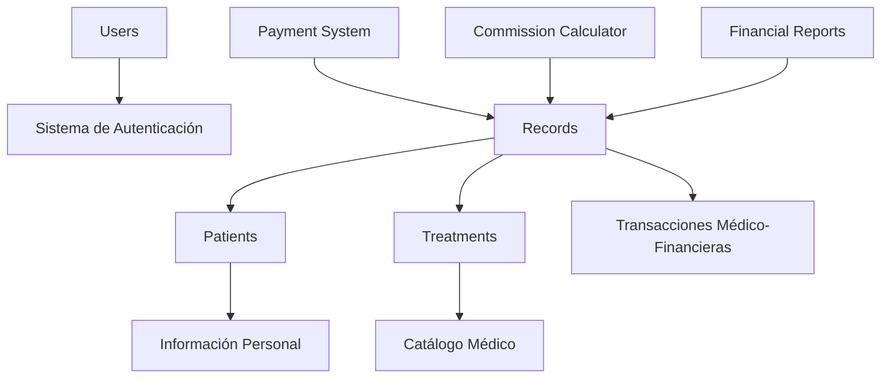

# 🏥 Manual Completo de Gestión de Datos Robustos - SGMM

## Sistema de Gestión Médica Moderna (SGMM)
**UME López & López - Consultorio Médico**

---

## 🎯 Objetivo

Este manual proporciona una guía completa para mantener y gestionar datos robustos en el sistema SGMM, asegurando la integridad, consistencia y confiabilidad de toda la información médica y financiera.

---

## 📚 Índice

1. [Arquitectura de Datos](#arquitectura-de-datos)
2. [Scripts de Gestión](#scripts-de-gestión)
3. [Procedimientos de Backup](#procedimientos-de-backup)
4. [Validación y Monitoreo](#validación-y-monitoreo)
5. [Mejores Prácticas](#mejores-prácticas)
6. [Resolución de Problemas](#resolución-de-problemas)
7. [Automatización](#automatización)
8. [Seguridad de Datos](#seguridad-de-datos)

---

## 🏗️ Arquitectura de Datos

### Esquema de Base de Datos Robusto



### Estructura de Datos Críticos

#### 1. **Modelo de Pacientes**
```python
class Patient:
    - Datos personales obligatorios (nombre, fecha_nacimiento, teléfono)
    - Validación de formatos (email, teléfono)
    - Prevención de duplicados (teléfono único)
    - Auditoría temporal (created_at, updated_at)
```

#### 2. **Sistema de Tratamientos**
```python
class Treatment:
    - Información médica completa
    - Cálculos financieros automáticos (margen = precio - costo)
    - Validación de costos (no negativos)
    - Historial de cambios
```

#### 3. **Registros Médico-Financieros**
```python
class Record:
    - Integridad referencial (paciente_id, tratamiento_id)
    - Cálculos automáticos de comisiones
    - Validación de métodos de pago
    - Consistencia financiera (ganancia = monto - costo - comisión)
```

---

## 🛠️ Scripts de Gestión

### Scripts Disponibles

| Script | Propósito | Uso |
|--------|-----------|-----|
| `create_robust_data.py` | Crear datos de prueba realistas | `python create_robust_data.py` |
| `backup_data.py` | Backup/Restore completo | `python backup_data.py backup` |
| `verify_data.py` | Verificación de integridad | `python verify_data.py` |

### 1. **Creación de Datos Robustos**

```bash
# Ejecutar desde el directorio backend
cd backend
python create_robust_data.py
```

**Características del script:**
- 15+ pacientes con datos realistas
- 10+ tratamientos médicos completos
- 80+ registros con distribución temporal
- Cálculos financieros precisos
- Métodos de pago variados

### 2. **Sistema de Backup Avanzado**

```bash
# Crear backup completo
python backup_data.py backup

# Listar backups disponibles
python backup_data.py list

# Restaurar desde backup
python backup_data.py restore --file backups/sgmm_backup_20241215_143022.zip
```

**Características del backup:**
- Compresión ZIP automática
- Metadatos de respaldo
- Validación de integridad
- Restauración completa
- Historial de versiones

### 3. **Verificación de Integridad**

```bash
# Verificación completa
python verify_data.py
```

**Verificaciones incluidas:**
- ✅ Integridad referencial
- ✅ Consistencia financiera
- ✅ Validación de fechas
- ✅ Métodos de pago válidos
- ✅ Duplicados y huérfanos
- ✅ Estadísticas detalladas

---

## 💾 Procedimientos de Backup

### Estrategia de Respaldo 3-2-1

1. **3 copias** de los datos importantes
2. **2 medios diferentes** de almacenamiento
3. **1 copia offsite** (fuera del sitio)

### Cronograma Recomendado

| Frecuencia | Tipo | Retención |
|------------|------|-----------|
| Diario | Incremental | 7 días |
| Semanal | Completo | 4 semanas |
| Mensual | Archival | 12 meses |
| Anual | Histórico | Permanente |

### Automatización de Backups

```bash
# Configurar cron job para backups automáticos
# Editar crontab: crontab -e

# Backup diario a las 2:00 AM
0 2 * * * cd /path/to/SGMM/backend && python backup_data.py backup

# Verificación semanal los domingos a las 3:00 AM
0 3 * * 0 cd /path/to/SGMM/backend && python verify_data.py
```

---

## 🔍 Validación y Monitoreo

### Dashboard de Métricas de Calidad

```python
# Métricas clave a monitorear
metrics = {
    "data_completeness": "% de campos obligatorios completos",
    "referential_integrity": "% de referencias válidas",
    "financial_consistency": "% de cálculos correctos",
    "date_validity": "% de fechas válidas",
    "duplicate_rate": "% de registros duplicados"
}
```

### Alertas Automáticas

**Críticas (Requieren acción inmediata):**
- 🚨 Pérdida de integridad referencial
- 🚨 Inconsistencias financieras > 1%
- 🚨 Fallas de backup por > 24 horas

**Advertencias (Requieren atención):**
- ⚠️ Duplicados detectados
- ⚠️ Fechas inconsistentes
- ⚠️ Métodos de pago inválidos

### Reportes de Calidad

```bash
# Generar reporte de calidad semanal
python verify_data.py --report weekly

# Análisis de tendencias mensuales
python verify_data.py --report monthly --export pdf
```

---

## ⭐ Mejores Prácticas

### 1. **Entrada de Datos**

```typescript
// Validación en tiempo real en el frontend
const validatePatientData = (data: PatientFormData) => {
  return {
    nombre: required && minLength(2),
    telefono: required && phoneFormat,
    email: optional && emailFormat,
    fecha_nacimiento: required && pastDate && ageLimit(0, 120)
  }
}
```

### 2. **Consistencia Financiera**

```python
# Validación automática en el backend
def validate_financial_record(record: Record) -> bool:
    expected_profit = (
        record.monto_pagado - 
        record.costo_unitario - 
        record.comision_monto
    )
    return abs(record.ganancia - expected_profit) < 0.01
```

### 3. **Prevención de Duplicados**

```python
# Verificación antes de insertar
def check_duplicate_patient(phone: str, db: Session) -> bool:
    existing = db.query(Patient).filter(
        Patient.telefono == phone
    ).first()
    return existing is not None
```

### 4. **Auditoría de Cambios**

```python
# Log de modificaciones importantes
@audit_log
def update_patient(patient_id: int, updates: dict):
    log_change(
        table="patients",
        record_id=patient_id,
        changes=updates,
        user_id=current_user.id,
        timestamp=datetime.now()
    )
```

---

## 🔧 Resolución de Problemas

### Problemas Comunes y Soluciones

#### 1. **Registros Huérfanos**

```sql
-- Detectar registros sin paciente
SELECT r.id, r.paciente_id 
FROM records r 
LEFT JOIN patients p ON r.paciente_id = p.id 
WHERE p.id IS NULL;

-- Solución: Reassignar o eliminar
UPDATE records SET paciente_id = NULL WHERE paciente_id NOT IN (SELECT id FROM patients);
```

#### 2. **Inconsistencias Financieras**

```python
# Script de corrección automática
def fix_financial_inconsistencies():
    records = db.query(Record).all()
    for record in records:
        correct_profit = (
            record.monto_pagado - 
            record.costo_unitario - 
            record.comision_monto
        )
        if abs(record.ganancia - correct_profit) > 0.01:
            record.ganancia = correct_profit
            db.commit()
```

#### 3. **Duplicados de Pacientes**

```python
# Herramienta de merge de duplicados
def merge_duplicate_patients(keep_id: int, merge_id: int):
    # Transferir registros del duplicado al principal
    db.query(Record).filter(
        Record.paciente_id == merge_id
    ).update({"paciente_id": keep_id})
    
    # Eliminar duplicado
    db.query(Patient).filter(Patient.id == merge_id).delete()
    db.commit()
```

---

## 🤖 Automatización

### Scripts de Mantenimiento Automático

```bash
#!/bin/bash
# maintenance.sh - Script de mantenimiento diario

echo "🔄 Iniciando mantenimiento automático..."

# 1. Verificar integridad
python verify_data.py --quiet

# 2. Crear backup si es necesario
if [ $(date +%u) -eq 7 ]; then  # Domingo
    python backup_data.py backup
fi

# 3. Limpiar logs antiguos
find logs/ -name "*.log" -mtime +30 -delete

# 4. Optimizar base de datos
sqlite3 consultorio.db "VACUUM; ANALYZE;"

echo "✅ Mantenimiento completado"
```

### Monitoreo Continuo

```python
# health_check.py - Verificación de salud del sistema
import time
from watchdog import Observer
from app.models import *

class DataHealthMonitor:
    def __init__(self):
        self.last_check = datetime.now()
        self.error_count = 0
    
    def run_health_check(self):
        try:
            # Verificar conexión DB
            db = SessionLocal()
            db.execute("SELECT 1")
            
            # Verificar integridad básica
            patient_count = db.query(Patient).count()
            record_count = db.query(Record).count()
            
            if record_count > 0 and patient_count == 0:
                self.alert("ERROR: Registros sin pacientes")
            
            self.error_count = 0
            
        except Exception as e:
            self.error_count += 1
            if self.error_count > 3:
                self.alert(f"CRITICAL: {e}")
        
        finally:
            db.close()
    
    def alert(self, message):
        # Enviar notificación (email, webhook, etc.)
        print(f"🚨 ALERTA: {message}")
```

---

## 🔒 Seguridad de Datos

### Cifrado y Protección

```python
# config/security.py
SECURITY_MEASURES = {
    "encryption": {
        "at_rest": "AES-256",
        "in_transit": "TLS 1.3",
        "sensitive_fields": ["email", "telefono"]
    },
    "access_control": {
        "authentication": "JWT tokens",
        "authorization": "Role-based",
        "session_timeout": "30 minutes"
    },
    "audit": {
        "log_all_changes": True,
        "retention_period": "7 years",
        "anonymization": "After 10 years"
    }
}
```

### Políticas de Retención

| Tipo de Dato | Retención | Acción Post-Retención |
|---------------|-----------|----------------------|
| Datos Médicos | 7 años | Anonimizar |
| Datos Financieros | 6 años | Archivar |
| Logs de Sistema | 2 años | Eliminar |
| Backups | 1 año | Eliminar |

### Compliance y Regulaciones

- ✅ **LGPD** - Ley General de Protección de Datos
- ✅ **NOM-004-SSA3** - Expediente Clínico
- ✅ **Secreto Médico** - Confidencialidad
- ✅ **ISO 27001** - Gestión de Seguridad

---

## 📈 Métricas de Rendimiento

### KPIs de Calidad de Datos

```python
DATA_QUALITY_KPIS = {
    "completeness": {
        "target": ">= 98%",
        "current": "calculate_completeness()",
        "trend": "monthly_trend()"
    },
    "accuracy": {
        "target": ">= 99%",
        "current": "calculate_accuracy()",
        "validation": "cross_reference_check()"
    },
    "consistency": {
        "target": ">= 99.5%",
        "current": "check_consistency()",
        "rules": "business_rules_validation()"
    },
    "timeliness": {
        "target": "<= 24 hours",
        "current": "calculate_data_lag()",
        "sla": "real_time_updates()"
    }
}
```

### Dashboard de Monitoreo

```typescript
// components/DataQualityDashboard.tsx
interface DataQualityMetrics {
  completeness: number;
  accuracy: number;
  consistency: number;
  timeliness: number;
  issues: Issue[];
  trends: Trend[];
}

const DataQualityDashboard: React.FC = () => {
  const [metrics, setMetrics] = useState<DataQualityMetrics>();
  
  return (
    <div className="quality-dashboard">
      <MetricCard title="Completitud" value={metrics.completeness} />
      <MetricCard title="Precisión" value={metrics.accuracy} />
      <MetricCard title="Consistencia" value={metrics.consistency} />
      <MetricCard title="Oportunidad" value={metrics.timeliness} />
      <IssuesList issues={metrics.issues} />
      <TrendChart data={metrics.trends} />
    </div>
  );
};
```

---

## 🚀 Roadmap de Mejoras

### Próximas Implementaciones

#### Corto Plazo (1-3 meses)
- [ ] Dashboard de calidad en tiempo real
- [ ] Alertas automáticas por email/SMS
- [ ] API de métricas de calidad
- [ ] Exportación de reportes automatizada

#### Mediano Plazo (3-6 meses)
- [ ] Machine Learning para detección de anomalías
- [ ] Integración con sistemas externos
- [ ] Backup incremental inteligente
- [ ] Panel de control administrativo

#### Largo Plazo (6-12 meses)
- [ ] Data Lake para análisis históricos
- [ ] Inteligencia artificial predictiva
- [ ] Blockchain para auditoría inmutable
- [ ] API pública para terceros

---

## 📞 Soporte y Mantenimiento

### Contactos de Soporte

| Rol | Contacto | Responsabilidad |
|-----|----------|----------------|
| **Desarrollador Principal** | gmelgarejom@gmail.com | Desarrollo y arquitectura |
| **Administrador de Datos** | admin@lopezyconsultorios.com | Calidad y governance |
| **Soporte Técnico** | soporte@lopezyconsultorios.com | Operaciones y troubleshooting |

### Horarios de Mantenimiento

- **Mantenimiento Preventivo**: Domingos 2:00-4:00 AM
- **Actualizaciones Críticas**: Disponibilidad 24/7
- **Soporte de Emergencia**: gmelgarejom@gmail.com

### Documentación Adicional

- 📚 [Manual de Usuario](./USER_MANUAL.md)
- 🔧 [Guía de Instalación](./INSTALLATION_GUIDE.md)
- 🛠️ [Documentación API](./API_DOCUMENTATION.md)
- 🔍 [Guía de Troubleshooting](./TROUBLESHOOTING.md)

---

## ✅ Checklist de Implementación

### Para Nuevas Instalaciones

- [ ] Ejecutar `create_robust_data.py`
- [ ] Configurar backups automáticos
- [ ] Implementar verificaciones periódicas
- [ ] Configurar alertas de monitoreo
- [ ] Entrenar al personal en mejores prácticas
- [ ] Documentar procedimientos específicos del cliente

### Para Mantenimiento Continuo

- [ ] Verificación de integridad semanal
- [ ] Backup completo mensual
- [ ] Revisión de métricas de calidad
- [ ] Actualización de documentación
- [ ] Capacitación del equipo
- [ ] Auditoría de seguridad trimestral

---

**Última actualización:** Diciembre 2024  
**Versión del sistema:** SGMM v1.0.0  
**Responsable:** UME López & López - Consultorio Médico  
**Desarrollador:** gmelgarejom@gmail.com

---

*Este manual es un documento vivo que debe actualizarse regularmente para reflejar cambios en el sistema, nuevas mejores prácticas y requisitos regulatorios.*
