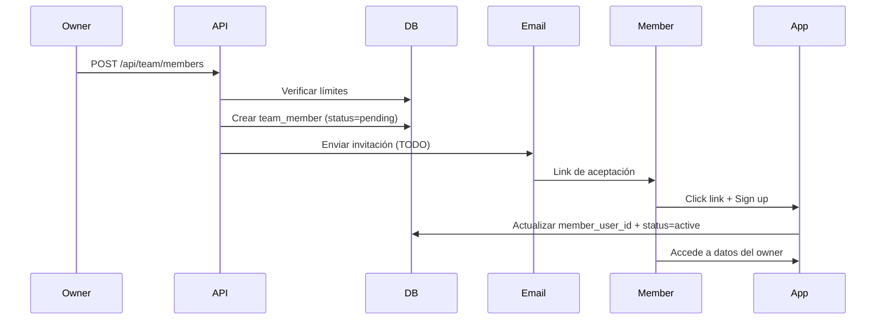

# 👥 Sistema de Equipos - Team Members

Sistema multi-usuario que permite a los propietarios de cuentas invitar colaboradores para compartir acceso al sistema AgendaMedPro.

## 📋 Características

- ✅ Invitar miembros del equipo por email
- ✅ Roles predefinidos con permisos granulares
- ✅ Límites basados en el plan de suscripción
- ✅ Gestión de acceso compartido a datos
- ✅ Estados de invitación (pendiente/activo/inactivo)
- ✅ RLS automático para datos compartidos

## 🏗️ Arquitectura

### Modelo de Datos: **Team Members**

```
Owner (paga suscripción)
  ├── Team Member 1 (doctor)
  ├── Team Member 2 (recepcionista)
  └── Team Member 3 (admin)

→ Todos los miembros ven los datos del owner
→ El owner controla quién tiene acceso
```

### Tablas de Base de Datos

#### `team_members`
```sql
- id: UUID
- owner_user_id: UUID (quien invita)
- member_user_id: UUID (quien acepta)
- member_email: TEXT
- role: TEXT (owner|admin|doctor|receptionist|viewer)
- status: TEXT (pending|active|inactive)
- permissions: JSONB (permisos granulares)
- location_id: UUID (opcional)
- invitation_token: TEXT
```

## 🎭 Roles y Permisos

### Owner / Admin
- ✅ Ver, editar, eliminar todo
- ✅ Gestionar equipo
- ✅ Ver reportes financieros
- ✅ Gestionar inventario

### Doctor
- ✅ Ver y editar pacientes
- ✅ Ver y editar registros médicos
- ✅ Ver y editar citas
- ✅ Ver inventario
- ❌ Eliminar datos
- ❌ Gestionar equipo

### Recepcionista
- ✅ Ver y editar pacientes
- ✅ Ver y editar citas
- ✅ Ver registros médicos
- ❌ Editar registros médicos
- ❌ Ver reportes financieros

### Viewer (Solo Lectura)
- ✅ Ver pacientes
- ✅ Ver citas
- ✅ Ver registros médicos
- ❌ Editar cualquier cosa

## 🚀 Uso

### Frontend

#### Página de Gestión
```typescript
// /dashboard/settings/team
import { useTeam } from '@/hooks/useTeam';

const { members, stats, inviteMember } = useTeam();

// Invitar miembro
await inviteMember('doctor@email.com', 'doctor');
```

#### Componentes
```typescript
import { ROLE_LABELS, ROLE_DESCRIPTIONS } from '@/lib/types/team';

<span>{ROLE_LABELS['doctor']}</span> // → "Doctor"
<p>{ROLE_DESCRIPTIONS['doctor']}</p> // → "Puede ver y editar..."
```

### Backend

#### API Endpoints

**GET /api/team/members**
```json
{
  "members": [...],
  "stats": {
    "total_members": 3,
    "active_members": 2,
    "pending_invitations": 1,
    "max_allowed": 10,
    "can_invite_more": true
  }
}
```

**POST /api/team/members**
```json
{
  "email": "doctor@email.com",
  "role": "doctor",
  "location_id": "uuid" // opcional
}
```

**PATCH /api/team/members/:id**
```json
{
  "role": "admin",
  "status": "active",
  "permissions": {
    "can_edit_patients": true
  }
}
```

**DELETE /api/team/members/:id**
Elimina el acceso del miembro.

## 🔒 Seguridad (RLS)

### Políticas Actualizadas

Los datos ahora son accesibles por:
1. El dueño original (`user_id = auth.uid()`)
2. Miembros activos del equipo del dueño

```sql
-- Ejemplo: Pacientes
CREATE POLICY "Users can view own or team patients"
  ON patients FOR SELECT
  USING (
    user_id = auth.uid() -- Propios
    OR user_id IN ( -- O del owner si soy miembro activo
      SELECT owner_user_id FROM team_members
      WHERE member_user_id = auth.uid()
      AND status = 'active'
    )
  );
```

Aplicado a:
- ✅ patients
- ✅ appointments
- ✅ treatments
- ✅ records
- ✅ inventory_items
- ✅ inventory_movements
- ✅ gastos_fijos
- ✅ gastos_variables

## 💼 Límites de Suscripción

Los límites se toman de la tabla `subscriptions`:

| Plan       | max_doctors | max_locations |
|------------|-------------|---------------|
| Básico     | 2           | 1             |
| Pro        | 10          | 5             |
| Enterprise | 999         | 999           |

**Validación automática:**
- Al invitar un miembro, se verifica el límite
- Si se alcanza el límite, muestra mensaje de upgrade

## 📧 Flow de Invitación



## 🛠️ Archivos Principales

```
vercel-migration/
├── supabase/migrations/
│   └── 20251111_team_members.sql       # Schema + RLS
├── lib/types/
│   └── team.ts                          # TypeScript types
├── hooks/
│   └── useTeam.ts                       # React hook
├── app/api/team/
│   ├── members/route.ts                 # GET + POST
│   └── members/[id]/route.ts            # GET + PATCH + DELETE
└── app/dashboard/settings/
    └── team/page.tsx                    # UI principal
```

## ✅ Testing

### 1. Crear cuenta de prueba
```bash
# Signup normal en /auth/signin
```

### 2. Verificar plan
```sql
SELECT max_doctors FROM subscriptions WHERE user_id = 'uuid';
```

### 3. Invitar miembro
```bash
# Ir a /dashboard/settings/team
# Click "Invitar Miembro"
# Ingresar email + rol
```

### 4. Verificar RLS
```sql
-- Como miembro, deberías ver datos del owner
SELECT * FROM patients; -- Debería mostrar pacientes del owner
```

## 🚀 Próximos Pasos

- [ ] Implementar envío de email de invitación
- [ ] Página de aceptación de invitación
- [ ] Permisos granulares por feature
- [ ] Asignación de miembros a locaciones específicas
- [ ] Audit log de acciones de miembros
- [ ] Notificaciones cuando un miembro acepta

## 📞 Soporte

Para dudas o problemas:
1. Revisar los logs de la consola
2. Verificar RLS policies en Supabase
3. Comprobar límites de suscripción

---

**Creado:** 2025-11-11  
**Versión:** 1.0.0  
**Estado:** ✅ Funcional (pendiente: email invitations)
