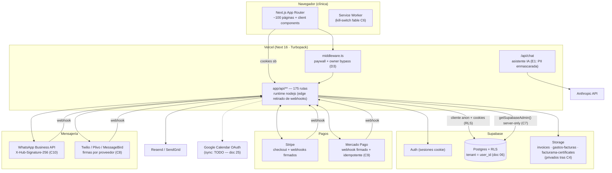

# 01 — Mapa de arquitectura

Auditoría fable · 2026-06-11. Reconstruido leyendo el código (no documentación previa). Cifras reales del repo: **175 rutas API** (doc 21), ~100 páginas App Router, 5 proveedores externos.

## Vista general

## Capas y responsabilidades

| Capa | Implementación | Notas de la auditoría |
|---|---|---|
| UI | App Router, Tailwind, shadcn/ui (47 componentes `components/ui`, 11 muertos eliminados) | Deuda lint concentrada aquí (OD-3) |
| Autorización de borde | `middleware.ts` | Paywall por suscripción; bypass de owner ahora por env (D3); **fail-open a `pro`** si la consulta falla — decisión documentada (doc 19) |
| API | 175 `route.ts` | Patrón sano: `getAuthUser()` + cliente cookie (RLS) + filtro `user_id`; excepciones corregidas en C2/F1; matriz completa en doc 21 |
| Datos | Postgres con RLS por `user_id` | Modelo en doc 06; agujeros C3/bundles con migración lista |
| Storage | 3+ buckets | Privados + signed URLs tras C4/G1 |
| Trabajos | `vercel.json` crons (`CRON_SECRET`) | Recordatorios y mantenimiento |
| IA | `/api/chat` con tool-use sobre datos de la clínica | Flujo de datos y privacidad en doc 24 |

## Doble sistema de autenticación (D1 — NO resuelto, decisión abierta)

Coexisten **Supabase Auth** (dominante: cookies + RLS, helper `getAuthUser()` de `lib/auth-server.ts`) y **NextAuth** legado (`/api/auth/[...nextauth]`, `getServerSession` en un puñado de rutas, secreto C5 ya fuera del bundle). Riesgos de la dualidad: dos superficies de sesión, dos expiraciones, confusión en middleware. Recomendación (doc 19/D1): inventariar rutas NextAuth-only y migrarlas a Supabase Auth en una iteración dedicada; **no** se intentó en esta auditoría por riesgo de romper login en producción.

## Flujos críticos (resumen)

1. **Cita pública** → `/api/public/availability|book/[slug]` (sin auth por diseño; rate limit pendiente: doc 29) → inserta con service role acotado al tenant del slug.
2. **Factura CFDI** → `/api/invoices` (auth) → Facturama (credenciales cifradas AES-256-GCM, `ENCRYPTION_MASTER_KEY`) → XML/PDF a Storage privado → email con signed URL 7 días.
3. **Suscripción** → Stripe/MP checkout → webhook firmado → `subscriptions` → middleware lee plan.
4. **Recordatorio WhatsApp** → cron → plantillas Meta → estados vía webhook firmado.
